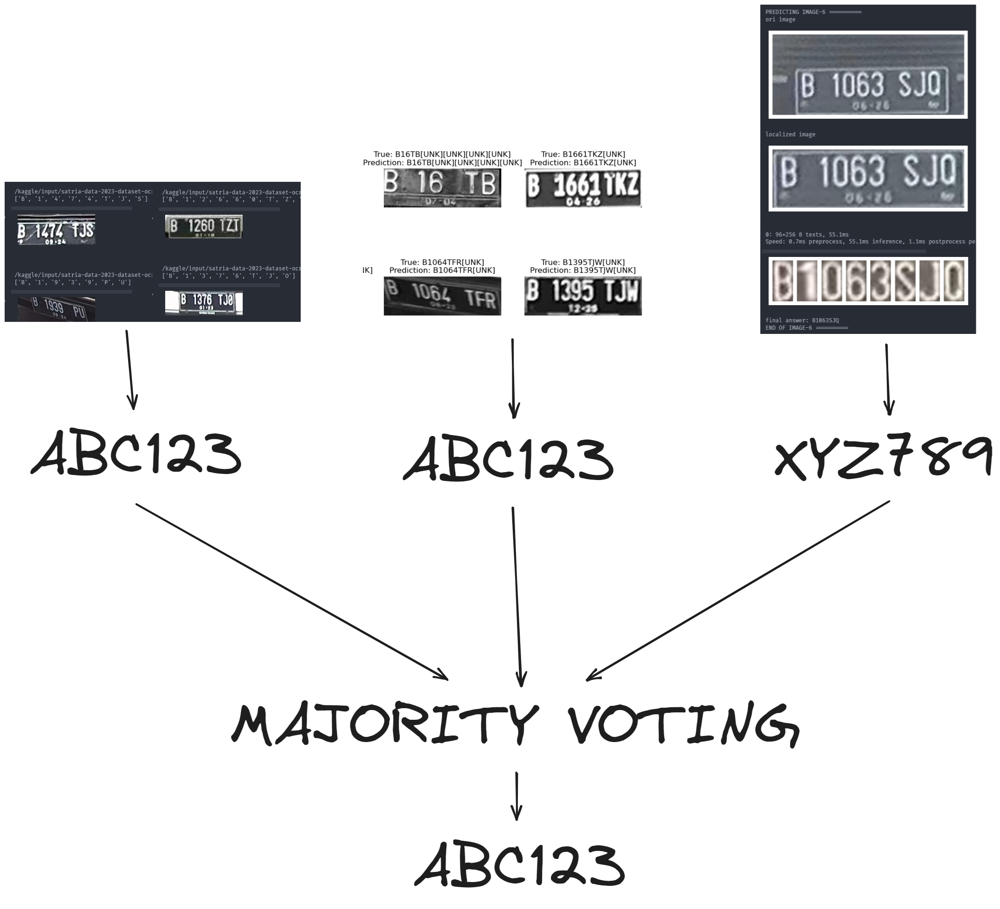
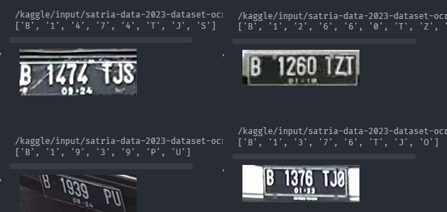
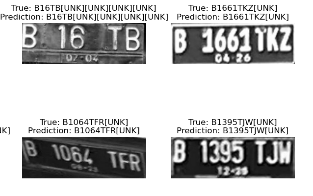
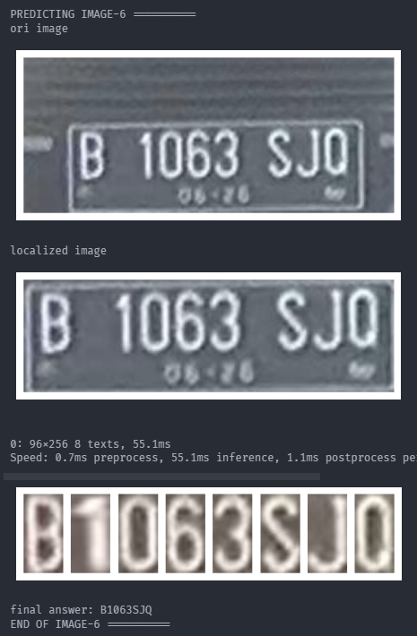

# Satria Data 2023 - Big Data Challenge

## What is Satria Data?

The Statistics and Data Science Festival (SATRIA DATA) is a national event aimed at enhancing the competence of students in the fields of statistics and data science. The event consists of three groups of activities: Insight Development, Competition Activities, and Credit Earning.

This event takes the form of a competition that measures the abilities of students in the fields of statistics, data science, and their applications. Not only will hard skills in Statistics and Data Science be competed, but also soft skills such as communication, visualization, collaboration, and creativity in solving complex problems. There are four types of competitions: National Statistics Competition (NSC), Statistics Essay Competition (SEC), Statistics Infographic Competition (SIC), and Big Data Challenge (BDC).

Of these four competition activities, my team and I participated in the Big Data Challenge (BDC) under the team name Hail Pompom.

## Task

The objective of the Big Data Challenge was to develop an algorithm for Automatic License Plate Recognition. The committee provided us with 800 training data and 100 test data without labels for submission.

## Members

- [Caesario Dito](https://github.com/caesariodito)
- [Daniel Prasetyo](https://github.com/danielprasetyo7952)
- [Rafael Mahesa](https://github.com/rafaelmahesa)

## Proposed Solution

Our proposed solution involved a three-model variant:

1. Utilizing Full Yolov8 Object Detection to identify characters.
2. Implementing a CTC Model to predict the license plate.
3. Employing a pipeline that included license plate localization, character segmentation, and character recognition with Yolov8 and Xception Transfer Learning

### Example of the majority voting

We combined the results from these three models and applied majority voting in hopes of enhancing the outcome.

## Result

To view the detailed results, you can view the notebook linked at the table below

|                          Full Yolov8                          |              CTC Architecture              |                    Pipeline                     |
| :-----------------------------------------------------------: | :----------------------------------------: | :---------------------------------------------: |
|                                 |    |                   |
| [view notebook](prediction-with-yolov8-objectdetection.ipynb) | [view notebook](prediction-with-ctc.ipynb) | [view notebook](prediction-with-pipeline.ipynb) |

## Further Improvement

- [ ] Use another model for the character recognition (pipeline) to increase its performance
- [ ] Improve character segmentation model since it was trained using object detection task
